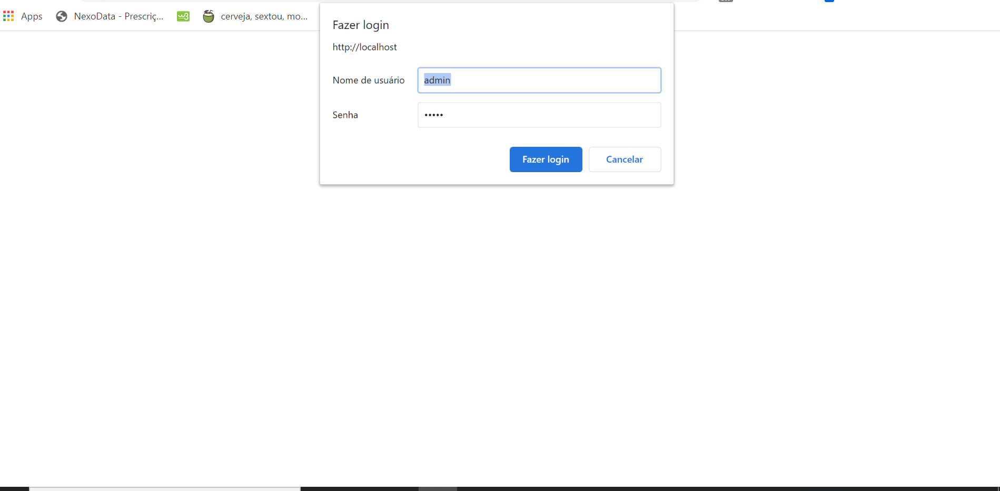
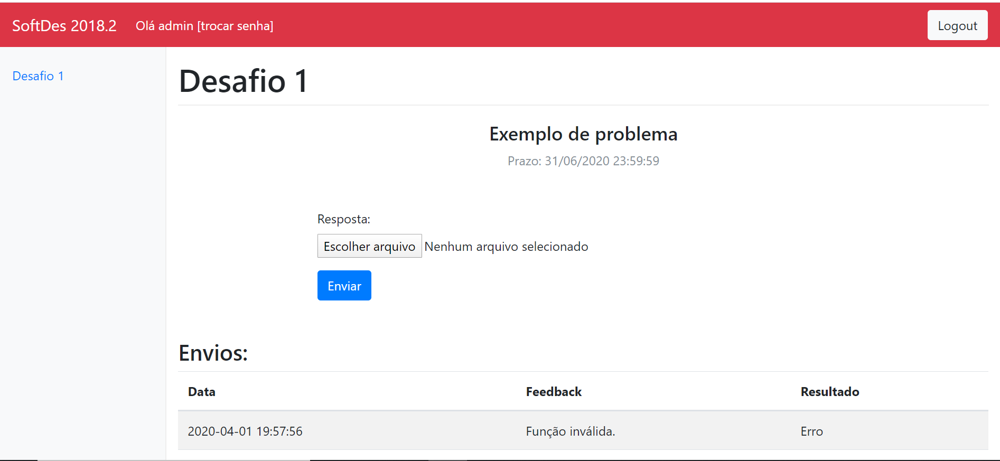
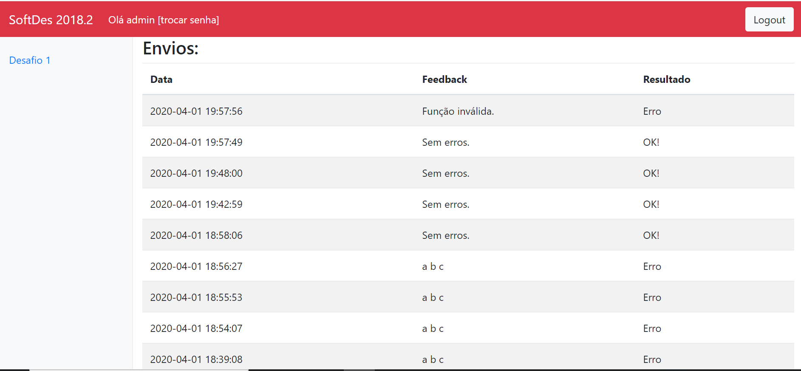
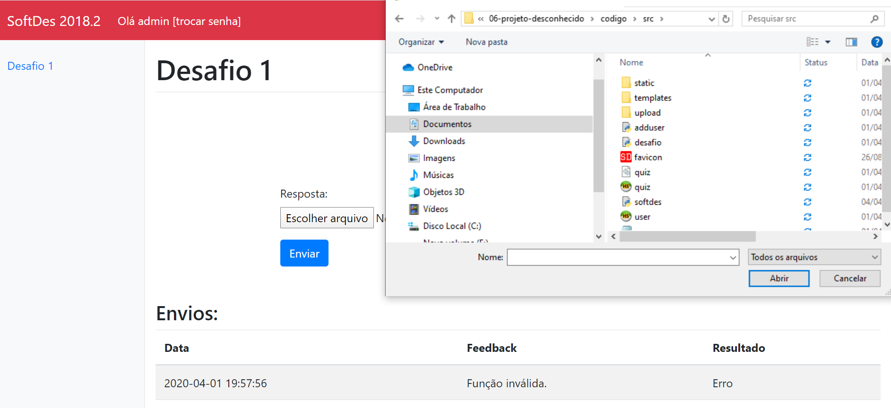
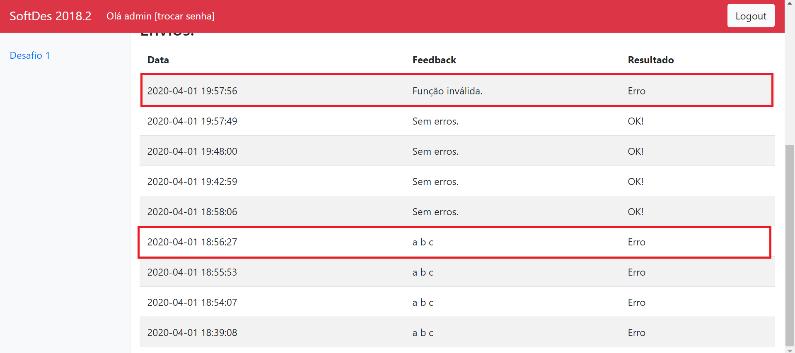
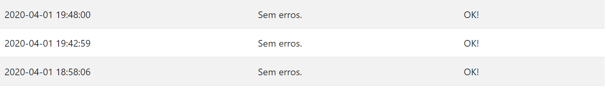
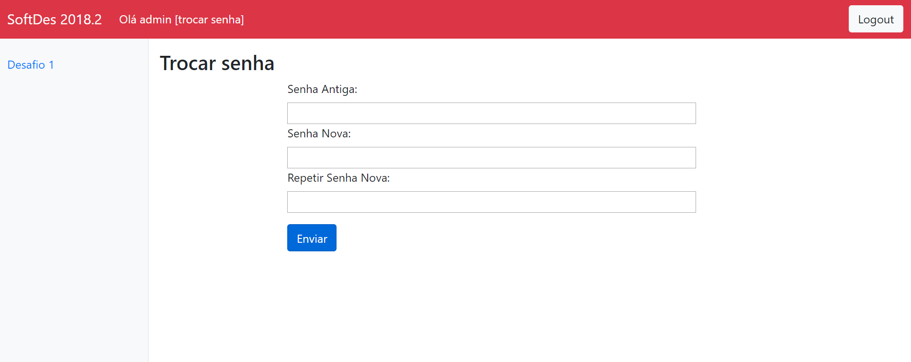

# Students Manual

This page is to guide any SoftDes enrolled student into how to use the system.

## Login

First of all check with your professor that you have been registered in the system. Once
you are sure of that let´s start our tour. Put your username and password on the respectives
fields:

## Initial Page

Once you are logged in you will see a page like below.

You can observe three different actions to do in this page:

* Send a file
* Change password
* Logout

And, if you scroll down the page you can see your past uploads (if you have done one):

Now, let's pass by each of these actions one by one!

## Uploading a file

Once you click in the button "Enviar Arquivo" the file explorer will open to 
you choose the file ("quiz") you want to submit. Once it opened you can double
click the selected file. After the file explorer closes you will be able to see 
the file you chose at the right of the button. If the it is the right file
click on the "Enviar" button for the submition.

## Wrong submition

When you submit a quiz that has some incorret function format or the 
response of the function it's not right then the system will provide you
a feedback.

## Success Submition

When you upload a file that is correct, including it response the system will
also provide you a feedback.

## Change password

When you click in the "trocar senha" label in the up left corner of the screen, you
will be redirected to this page:

By puting your last password and repeating your new password twice, you can click in
the "Enviar" button and your password will be changed.

## Logout

As our last step as student the last action left is to leave the system by clicking in the
logout button at the up right corner.

